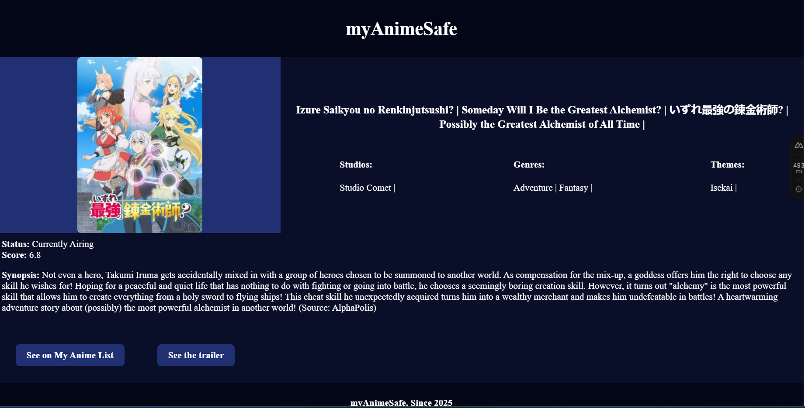

## Showcase




## About

This is a simple web app to see information about animes. There is a home page featuring many different types of animes and a separate page for specific information about each one.

It is still lacking in many aspects but at least it shows and uses the main features of Nuxt frontend.

## Setup

Make sure to install dependencies:

```bash
# npm
npm install

```

## Development Server

Start the development server on `http://localhost:3000`:

```bash
# npm
npm run dev

```

## More info

Look at the [Nuxt documentation](https://nuxt.com/docs/getting-started/introduction) to learn more.